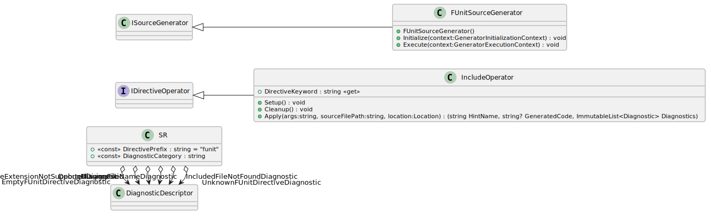
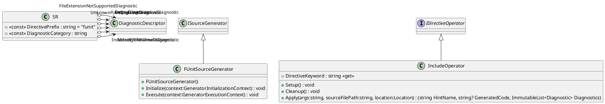
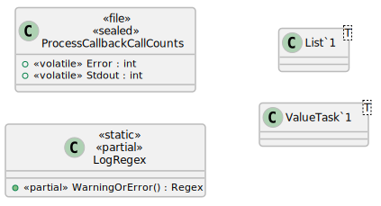
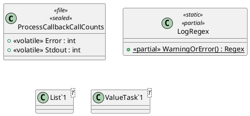
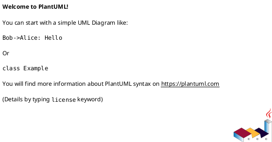
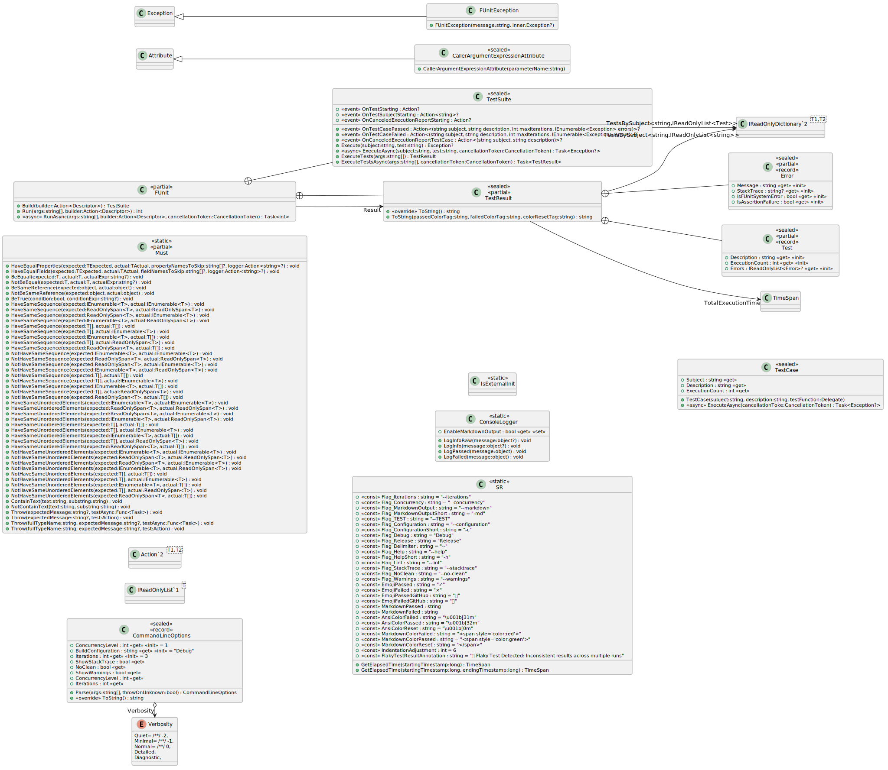

# Overall Changes
Generated by [dotnet-diagram](https://github.com/sator-imaging/dotnet-diagram) @ 2026-04-04 15:21:45

_No changes_

# FUnit.Directives

PlantUML

# FUnit.Run

PlantUML

# FUnit.Sandbox

PlantUML

# FUnit

```plantuml
@startuml
class FUnit <<static>> <<partial>> {
    + {static} Build(builder:Action<Descriptor>) : TestSuite
    + {static} Run(args:string[], builder:Action<Descriptor>) : int
    + {static} <<async>> RunAsync(args:string[], builder:Action<Descriptor>, cancellationToken:CancellationToken) : Task<int>
}
class "Action`2"<T1,T2> {
}
FUnit --> "Result" TestResult
class Must <<partial>> {
    + {static} HaveEqualProperties(expected:TExpected, actual:TActual, propertyNamesToSkip:string[]?, logger:Action<string>?) : void
    + {static} HaveEqualFields(expected:TExpected, actual:TActual, fieldNamesToSkip:string[]?, logger:Action<string>?) : void
}
class Must <<static>> <<partial>> {
    + {static} BeEqual(expected:T, actual:T, actualExpr:string?) : void
    + {static} NotBeEqual(expected:T, actual:T, actualExpr:string?) : void
    + {static} BeSameReference(expected:object, actual:object) : void
    + {static} NotBeSameReference(expected:object, actual:object) : void
    + {static} BeTrue(condition:bool, conditionExpr:string?) : void
    + {static} HaveSameSequence(expected:IEnumerable<T>, actual:IEnumerable<T>) : void
    + {static} HaveSameSequence(expected:ReadOnlySpan<T>, actual:ReadOnlySpan<T>) : void
    + {static} HaveSameSequence(expected:ReadOnlySpan<T>, actual:IEnumerable<T>) : void
    + {static} HaveSameSequence(expected:IEnumerable<T>, actual:ReadOnlySpan<T>) : void
    + {static} HaveSameSequence(expected:T[], actual:T[]) : void
    + {static} HaveSameSequence(expected:T[], actual:IEnumerable<T>) : void
    + {static} HaveSameSequence(expected:IEnumerable<T>, actual:T[]) : void
    + {static} HaveSameSequence(expected:T[], actual:ReadOnlySpan<T>) : void
    + {static} HaveSameSequence(expected:ReadOnlySpan<T>, actual:T[]) : void
    + {static} NotHaveSameSequence(expected:IEnumerable<T>, actual:IEnumerable<T>) : void
    + {static} NotHaveSameSequence(expected:ReadOnlySpan<T>, actual:ReadOnlySpan<T>) : void
    + {static} NotHaveSameSequence(expected:ReadOnlySpan<T>, actual:IEnumerable<T>) : void
    + {static} NotHaveSameSequence(expected:IEnumerable<T>, actual:ReadOnlySpan<T>) : void
    + {static} NotHaveSameSequence(expected:T[], actual:T[]) : void
    + {static} NotHaveSameSequence(expected:T[], actual:IEnumerable<T>) : void
    + {static} NotHaveSameSequence(expected:IEnumerable<T>, actual:T[]) : void
    + {static} NotHaveSameSequence(expected:T[], actual:ReadOnlySpan<T>) : void
    + {static} NotHaveSameSequence(expected:ReadOnlySpan<T>, actual:T[]) : void
    + {static} HaveSameUnorderedElements(expected:IEnumerable<T>, actual:IEnumerable<T>) : void
    + {static} HaveSameUnorderedElements(expected:ReadOnlySpan<T>, actual:ReadOnlySpan<T>) : void
    + {static} HaveSameUnorderedElements(expected:ReadOnlySpan<T>, actual:IEnumerable<T>) : void
    + {static} HaveSameUnorderedElements(expected:IEnumerable<T>, actual:ReadOnlySpan<T>) : void
    + {static} HaveSameUnorderedElements(expected:T[], actual:T[]) : void
    + {static} HaveSameUnorderedElements(expected:T[], actual:IEnumerable<T>) : void
    + {static} HaveSameUnorderedElements(expected:IEnumerable<T>, actual:T[]) : void
    + {static} HaveSameUnorderedElements(expected:T[], actual:ReadOnlySpan<T>) : void
    + {static} HaveSameUnorderedElements(expected:ReadOnlySpan<T>, actual:T[]) : void
    + {static} NotHaveSameUnorderedElements(expected:IEnumerable<T>, actual:IEnumerable<T>) : void
    + {static} NotHaveSameUnorderedElements(expected:ReadOnlySpan<T>, actual:ReadOnlySpan<T>) : void
    + {static} NotHaveSameUnorderedElements(expected:ReadOnlySpan<T>, actual:IEnumerable<T>) : void
    + {static} NotHaveSameUnorderedElements(expected:IEnumerable<T>, actual:ReadOnlySpan<T>) : void
    + {static} NotHaveSameUnorderedElements(expected:T[], actual:T[]) : void
    + {static} NotHaveSameUnorderedElements(expected:T[], actual:IEnumerable<T>) : void
    + {static} NotHaveSameUnorderedElements(expected:IEnumerable<T>, actual:T[]) : void
    + {static} NotHaveSameUnorderedElements(expected:T[], actual:ReadOnlySpan<T>) : void
    + {static} NotHaveSameUnorderedElements(expected:ReadOnlySpan<T>, actual:T[]) : void
    + {static} ContainText(text:string, substring:string) : void
    + {static} NotContainText(text:string, substring:string) : void
    + {static} Throw(expectedMessage:string?, testAsync:Func<Task>) : void
    + {static} Throw(expectedMessage:string?, test:Action) : void
    + {static} Throw(fullTypeName:string, expectedMessage:string?, testAsync:Func<Task>) : void
    + {static} Throw(fullTypeName:string, expectedMessage:string?, test:Action) : void
}
class FUnit <<partial>> {
}
class TestResult <<sealed>> <<partial>> {
    + <<override>> ToString() : string
    + ToString(passedColorTag:string, failedColorTag:string, colorResetTag:string) : string
}
class Error <<sealed>> <<partial>> <<record>> {
    + Message : string <<get>> <<init>>
    + StackTrace : string? <<get>> <<init>>
    + IsFUnitSystemError : bool <<get>> <<init>>
    + IsAssertionFailure : bool <<get>> <<init>>
}
class Test <<sealed>> <<partial>> <<record>> {
    + Description : string <<get>> <<init>>
    + ExecutionCount : int <<get>> <<init>>
    + Errors : IReadOnlyList<Error>? <<get>> <<init>>
}
class "IReadOnlyDictionary`2"<T1,T2> {
}
class "IReadOnlyList`1"<T> {
}
FUnit +-- TestResult
TestResult --> "TotalExecutionTime" TimeSpan
TestResult --> "TestsBySubject<string,IReadOnlyList<Test>>" "IReadOnlyDictionary`2"
TestResult +-- Error
TestResult +-- Test
class FUnit <<partial>> {
}
class "Action`2"<T1,T2> {
}
class TestSuite <<sealed>> {
    +  <<event>> OnTestStarting : Action? 
    +  <<event>> OnTestSubjectStarting : Action<string>? 
    +  <<event>> OnTestCasePassed : Action<(string subject, string description, int maxIterations, IEnumerable<Exception> errors)>? 
    +  <<event>> OnTestCaseFailed : Action<(string subject, string description, int maxIterations, IEnumerable<Exception> errors)>? 
    +  <<event>> OnCanceledExecutionReportStarting : Action? 
    +  <<event>> OnCanceledExecutionReportTestCase : Action<(string subject, string description)>? 
    + Execute(subject:string, test:string) : Exception?
    + <<async>> ExecuteAsync(subject:string, test:string, cancellationToken:CancellationToken) : Task<Exception?>
    + ExecuteTests(args:string[]) : TestResult
    + ExecuteTestsAsync(args:string[], cancellationToken:CancellationToken) : Task<TestResult>
}
class "IReadOnlyDictionary`2"<T1,T2> {
}
FUnit +-- TestSuite
TestSuite --> "TestsBySubject<string,IReadOnlyList<string>>" "IReadOnlyDictionary`2"
class IsExternalInit <<static>> {
}
class CallerArgumentExpressionAttribute <<sealed>> {
    + CallerArgumentExpressionAttribute(parameterName:string)
}
Attribute <|-- CallerArgumentExpressionAttribute
class TestCase <<sealed>> {
    + Subject : string <<get>>
    + Description : string <<get>>
    + ExecutionCount : int <<get>>
    + TestCase(subject:string, description:string, testFunction:Delegate)
    + <<async>> ExecuteAsync(cancellationToke:CancellationToken) : Task<Exception?>
}
class FUnitException {
    + FUnitException(message:string, inner:Exception?)
}
Exception <|-- FUnitException
enum Verbosity {
    Quiet=   /**/ -2,
    Minimal= /**/ -1,
    Normal=  /**/ 0,
    Detailed,
    Diagnostic,
}
class SR <<static>> {
    + <<const>> Flag_Iterations : string = "--iterations"
    + <<const>> Flag_Concurrency : string = "--concurrency"
    + <<const>> Flag_MarkdownOutput : string = "--markdown"
    + <<const>> Flag_MarkdownOutputShort : string = "-md"
    + <<const>> Flag_TEST : string = "--TEST"
    + <<const>> Flag_Configuration : string = "--configuration"
    + <<const>> Flag_ConfigurationShort : string = "-c"
    + <<const>> Flag_Debug : string = "Debug"
    + <<const>> Flag_Release : string = "Release"
    + <<const>> Flag_Delimiter : string = "--"
    + <<const>> Flag_Help : string = "--help"
    + <<const>> Flag_HelpShort : string = "-h"
    + <<const>> Flag_Lint : string = "--lint"
    + <<const>> Flag_StackTrace : string = "--stacktrace"
    + <<const>> Flag_NoClean : string = "--no-clean"
    + <<const>> Flag_Warnings : string = "--warnings"
    + <<const>> EmojiPassed : string = "✓"
    + <<const>> EmojiFailed : string = "×"
    + <<const>> EmojiPassedGitHub : string = "✅"
    + <<const>> EmojiFailedGitHub : string = "⛔"
    + <<const>> MarkdownPassed : string
    + <<const>> MarkdownFailed : string
    + <<const>> AnsiColorFailed : string = "\u001b[31m"
    + <<const>> AnsiColorPassed : string = "\u001b[32m"
    + <<const>> AnsiColorReset : string = "\u001b[0m"
    + <<const>> MarkdownColorFailed : string = "<span style='color:red'>"
    + <<const>> MarkdownColorPassed : string = "<span style='color:green'>"
    + <<const>> MarkdownColorReset : string = "</span>"
    + <<const>> IndentationAdjustment : int = 6
    + <<const>> FlakyTestResultAnnotation : string = "🔥 Flaky Test Detected: Inconsistent results across multiple runs"
    + {static} GetElapsedTime(startingTimestamp:long) : TimeSpan
    + {static} GetElapsedTime(startingTimestamp:long, endingTimestamp:long) : TimeSpan
}
class ConsoleLogger <<static>> {
    + {static} EnableMarkdownOutput : bool <<get>> <<set>>
    + {static} LogInfoRaw(message:object?) : void
    + {static} LogInfo(message:object?) : void
    + {static} LogPassed(message:object) : void
    + {static} LogFailed(message:object) : void
}
class CommandLineOptions <<sealed>> <<record>> {
    + ConcurrencyLevel : int <<get>> <<init>> = 1
    + BuildConfiguration : string <<get>> <<init>> = "Debug"
    + Iterations : int <<get>> <<init>> = 3
    + ShowStackTrace : bool <<get>>
    + NoClean : bool <<get>>
    + ShowWarnings : bool <<get>>
    + ConcurrencyLevel : int <<get>>
    + Iterations : int <<get>>
    + {static} Parse(args:string[], throwOnUnknown:bool) : CommandLineOptions
    + <<override>> ToString() : string
}
CommandLineOptions o-> "Verbosity" Verbosity
@enduml
```

PlantUML

